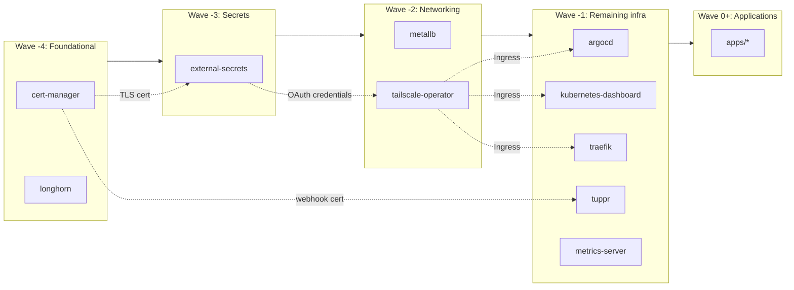

# Kubernetes GitOps

This directory contains all Kubernetes manifests managed by ArgoCD.

## Structure

```
kubernetes/
├── applications.yaml   # Root app-of-apps (applied during bootstrap)
├── appsets/            # ApplicationSets that generate ArgoCD Applications
│   ├── infra.yaml      # Generates apps for each chart in infra/
│   └── apps.yaml       # Generates apps for each chart in apps/
├── infra/              # Infrastructure Helm charts
└── apps/               # User application Helm charts
```

## How It Works

1. During bootstrap, `applications.yaml` is applied - this creates a root ArgoCD Application
2. The root app watches `appsets/` and applies the ApplicationSets
3. Each ApplicationSet scans its target directory (`infra/` or `apps/`) and generates an ArgoCD Application for each Helm chart found
4. ArgoCD syncs each Application, deploying the Helm charts to the cluster

## Sync Wave Order

ArgoCD uses [sync-waves](https://argo-cd.readthedocs.io/en/stable/user-guide/sync-waves/) to control the order Applications sync. Infrastructure uses negative waves so user apps (wave 0+) always sync after infrastructure is ready.



| Wave | Components | Purpose |
|------|------------|---------|
| -4 | cert-manager, longhorn | TLS certificates, storage |
| -3 | external-secrets | Secrets management |
| -2 | metallb, tailscale-operator | Networking |
| -1 | argocd, kubernetes-dashboard, traefik, tuppr, metrics-server | Remaining infra |
| 0+ | User apps in `apps/` | Applications |

To set a custom sync wave, add `syncWave: "<number>"` to the app's `values.yaml`.

## Adding a New Application

1. Create a new directory under `apps/` with a Helm chart:
   ```
   apps/
   └── my-app/
       ├── Chart.yaml
       ├── values.yaml
       └── templates/
   ```
2. Commit and push - ArgoCD will automatically detect and deploy it
