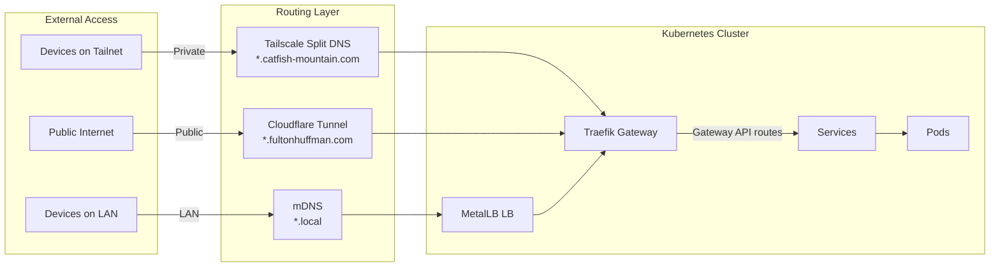
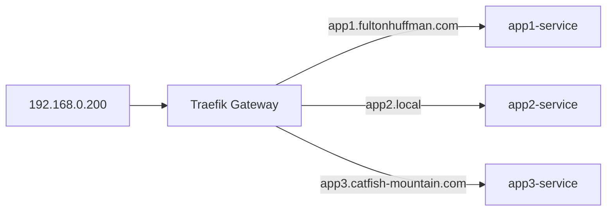

# Infrastructure Components

This directory contains Helm charts for cluster infrastructure, deployed via ArgoCD.

## Components

| Component | Purpose | Exposed via |
|-----------|---------|-------------|
| [argocd](./argocd) | GitOps continuous delivery - syncs cluster state from this repo | *.catfish-mountain.com |
| [cert-manager](./cert-manager) | TLS certificate management (Let's Encrypt + homelab CA) | - |
| [cluster-maintenance](./cluster-maintenance) | Cluster-level maintenance utilities (pod cleanup) | - |
| [external-secrets](./external-secrets) | Syncs secrets from Bitwarden into Kubernetes | - |
| [intel-device-plugins](./intel-device-plugins) | Intel GPU device plugins for QuickSync hardware transcoding | - |
| [kube-state-metrics](./kube-state-metrics) | Kubernetes object state metrics (deployments, pods, PVCs) | - |
| [longhorn](./longhorn) | Distributed block storage for persistent volumes | - |
| [mdns-advertiser](./mdns-advertiser) | Publishes services to LAN via mDNS/Bonjour | hostNetwork |
| [metallb](./metallb) | Load balancer for bare-metal - assigns LAN IPs | - |
| [metrics-server](./metrics-server) | Resource metrics for HPA, VPA, and `kubectl top` | - |
| [node-exporter](./node-exporter) | Node hardware metrics (CPU, memory, disk, temperature) | - |
| [signoz](./signoz) | Observability platform (metrics, logs, traces) | *.catfish-mountain.com |
| [signoz-k8s-infra](./signoz-k8s-infra) | Kubernetes metrics collection for SigNoz | - |
| [smartctl-exporter](./smartctl-exporter) | Disk SMART health metrics (NVMe, USB, SD cards) | - |
| [tailscale-operator](./tailscale-operator) | Exposes services on your Tailscale network | - |
| [time-machine](./time-machine) | Time Machine backup server for macOS | MetalLB |
| [traefik](./traefik) | Gateway API implementation for HTTP routing | *.catfish-mountain.com |
| [tuppr](./tuppr) | Automated Talos and Kubernetes upgrade orchestration | - |

## Networking Overview

Understanding how traffic flows in this cluster:



**Access patterns:**
- **Private infrastructure** (*.catfish-mountain.com) → Tailscale Split DNS → Gateway API → Services
- **Public services** (*.fultonhuffman.com, etc.) → Cloudflare Tunnel → Gateway API → Services
- **LAN services** (*.local) → mDNS → MetalLB → Gateway or direct

### CoreDNS (built into Kubernetes)
Provides DNS for pods and services inside the cluster. When a pod calls `http://my-service:8080`, CoreDNS resolves `my-service` to the Service's ClusterIP.

### Tailscale Split DNS
Routes `*.catfish-mountain.com` queries from Tailscale clients to the cluster. Configured in Tailscale admin console. Enables private access to infrastructure services from anywhere on the tailnet.

**Use for private infrastructure services:**
- ArgoCD, dashboards, admin UIs
- Internal APIs and tools
- Anything you want accessible remotely but **not** public

### Cloudflare Tunnel
Routes specific public subdomains (defined in `terraform/cloudflare/variables.tf`) to the cluster via secure tunnel. Most domains are **private by default** - only explicitly configured subdomains are public.

**Use for public services:**
- Personal websites and blogs
- Services you want publicly accessible
- Anything that should work for non-Tailscale users

### MetalLB
Assigns real LAN IPs to `LoadBalancer` Services. Without it (or a cloud provider), LoadBalancer services stay in `Pending` forever.

**Use MetalLB for:**
- The Traefik Gateway (gets a stable LAN IP)
- Non-HTTP services (SMB, databases, game servers)
- Services that need dedicated IPs

### Traefik Gateway
Kubernetes Gateway API implementation that routes HTTP(S) traffic based on Gateway API HTTPRoute resources. All HTTP services route through the Traefik Gateway at `192.168.0.200`.

**Why use a Gateway?** Shares one IP across many services:



Services use the `gateway-route` shared chart to create HTTPRoute resources. The same route can handle multiple hostnames (public, private, LAN).

### hostNetwork (for mDNS services)

Some services need mDNS/Bonjour for device discovery. mDNS uses multicast UDP which doesn't work across Kubernetes network namespaces. For these services, we use `hostNetwork: true` to bind directly to the node's network.

**Use hostNetwork for:**
- Time Machine (macOS auto-discovers backup destinations via mDNS)
- Home Assistant (discovers IoT devices like Chromecast, HomeKit, ESPHome via mDNS)

**Trade-offs:**
- Ports bind directly to the node IP (e.g., `192.168.0.99:445`)
- Less "Kubernetes-native" but necessary for mDNS
- Only use for services that genuinely require multicast discovery

## Choosing an Exposure Method

```
"What are the access requirements for this service?"

├── HTTP service (web UI, API)?
│   └── Use gateway-route chart → creates HTTPRoute
│
│       Choose hostname(s):
│       ├── Private remote access? → *.catfish-mountain.com
│       ├── Public access? → *.fultonhuffman.com (or other public domain)
│       └── LAN discovery? → *.local (with mDNS)
│
│       Can mix all three in one route!
│
├── Non-HTTP service (SMB, database, game server)?
│   └── Use MetalLB LoadBalancer → gets dedicated LAN IP
│
└── Needs mDNS discovery (auto-discovery on LAN)?
    └── Use hostNetwork → binds to node IP
```

### Quick Reference

| Service Type | Method | Example Hostname |
|--------------|--------|------------------|
| Admin UIs (ArgoCD, dashboards) | gateway-route | `argocd.catfish-mountain.com` |
| Public sites (blogs, portfolios) | gateway-route | `blog.fultonhuffman.com` |
| LAN web apps (Jellyfin, media) | gateway-route with mDNS | `media.local` |
| LAN non-HTTP (databases, SMB) | MetalLB LoadBalancer | `192.168.0.x:port` |
| mDNS-dependent (Time Machine) | hostNetwork | Auto-discovered |

### Multi-Hostname Example

Most services use a single HTTPRoute with multiple hostnames for different access methods:

```yaml
gateway-route:
  routes:
    - name: media
      hostnames:
        - media.fultonhuffman.com      # Public via Cloudflare Tunnel
        - media.catfish-mountain.com   # Private via Tailscale
        - media.local                  # LAN via mDNS
      service:
        name: jellyfin
        port: 8096
      mdns:  # Optional: advertise via Bonjour
        name: Media Server
        ip: 192.168.0.200
        port: 8096
```

**Note:** Some services need multiple exposure methods. For example, Home Assistant might use:
- `hostNetwork: true` (to discover IoT devices via mDNS)
- `gateway-route` (for web UI access at `home.local`)
