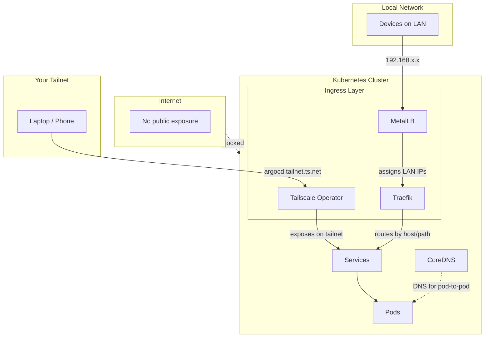
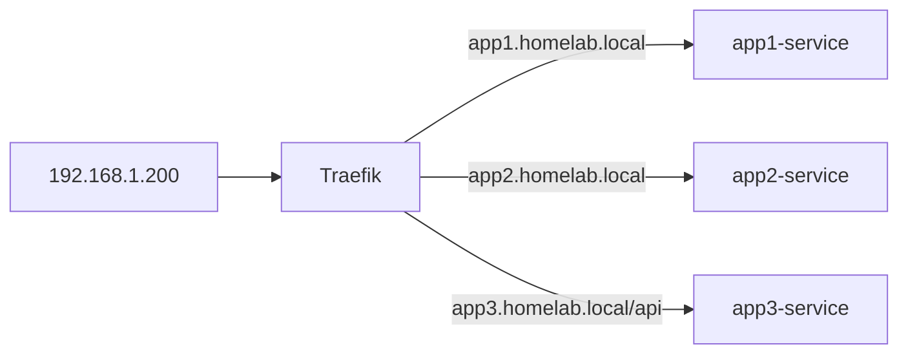

# Infrastructure Components

This directory contains Helm charts for cluster infrastructure, deployed via ArgoCD.

## Components

| Component | Purpose | Exposed via |
|-----------|---------|-------------|
| [argocd](./argocd) | GitOps continuous delivery - syncs cluster state from this repo | Tailscale |
| [cert-manager](./cert-manager) | TLS certificate management with a self-signed homelab CA | - |
| [external-secrets](./external-secrets) | Syncs secrets from Bitwarden into Kubernetes | - |
| [kubernetes-dashboard](./kubernetes-dashboard) | Web UI for cluster management | Tailscale |
| [metallb](./metallb) | Load balancer for bare-metal - assigns LAN IPs | - |
| [metrics-server](./metrics-server) | Resource metrics for HPA, VPA, and `kubectl top` | - |
| [tailscale-operator](./tailscale-operator) | Exposes services on your Tailscale network | - |
| [traefik](./traefik) | Ingress controller for LAN HTTP routing | Tailscale |

## Networking Overview

Understanding how traffic flows in a bare-metal Kubernetes cluster:

### CoreDNS (built into Kubernetes)
Provides DNS for pods and services inside the cluster. When a pod calls `http://my-service:8080`, CoreDNS resolves `my-service` to the Service's ClusterIP.

### Tailscale Operator
Exposes services directly on your Tailscale network - no port forwarding, no public IPs. Services get a `<name>.<tailnet>.ts.net` hostname accessible from any device on your tailnet.

**Use Tailscale for services you want accessible from anywhere** - laptop at a coffee shop, phone on cellular, etc:
- ArgoCD, dashboards, admin UIs
- Services you want to access remotely

### MetalLB
Assigns real LAN IPs to `LoadBalancer` Services. Without it (or a cloud provider), LoadBalancer services stay in `Pending` forever.

**Use MetalLB for LAN-only services** - things you only want accessible when physically on your home network:
- Time Machine backup targets (NFS/SMB) - keeps backup traffic local and fast
- Media servers for local streaming
- Anything that shouldn't be reachable remotely

### Traefik
Ingress controller that routes HTTP(S) traffic to Services based on hostname/path rules.

**Why use an ingress controller?** Without one, each HTTP service would need its own MetalLB IP. With Traefik, many services share one IP:

**In this homelab**, most services are exposed via Tailscale (which handles its own routing). Traefik is useful for:
- LAN-only HTTP services that shouldn't be on Tailscale
- Routing multiple LAN services through a single MetalLB IP
