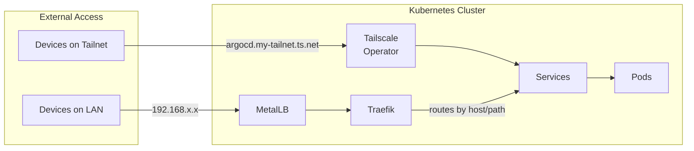
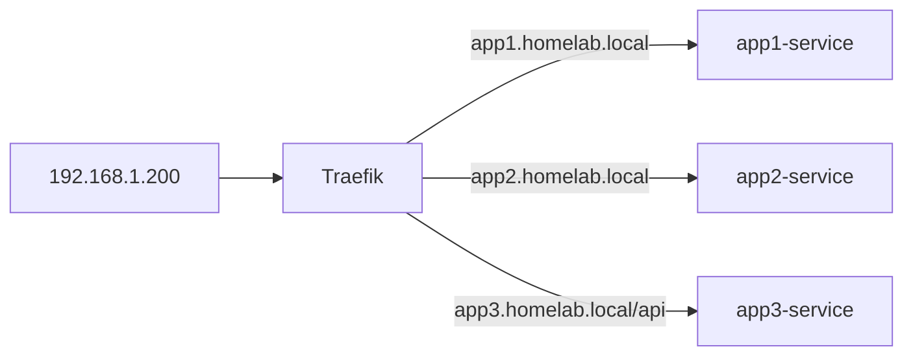

# Infrastructure Components

This directory contains Helm charts for cluster infrastructure, deployed via ArgoCD.

## Components

| Component | Purpose | Exposed via |
|-----------|---------|-------------|
| [argocd](./argocd) | GitOps continuous delivery - syncs cluster state from this repo | Tailscale |
| [cert-manager](./cert-manager) | TLS certificate management with a self-signed homelab CA | - |
| [cluster-maintenance](./cluster-maintenance) | Cluster-level maintenance utilities (pod cleanup) | - |
| [external-secrets](./external-secrets) | Syncs secrets from Bitwarden into Kubernetes | - |
| [intel-device-plugins](./intel-device-plugins) | Intel GPU device plugins for QuickSync hardware transcoding | - |
| [kube-state-metrics](./kube-state-metrics) | Kubernetes object state metrics (deployments, pods, PVCs) | - |
| [kubernetes-dashboard](./kubernetes-dashboard) | Web UI for cluster management | Tailscale |
| [longhorn](./longhorn) | Distributed block storage for persistent volumes | - |
| [mdns-advertiser](./mdns-advertiser) | Publishes services to LAN via mDNS/Bonjour | hostNetwork |
| [metallb](./metallb) | Load balancer for bare-metal - assigns LAN IPs | - |
| [metrics-server](./metrics-server) | Resource metrics for HPA, VPA, and `kubectl top` | - |
| [node-exporter](./node-exporter) | Node hardware metrics (CPU, memory, disk, temperature) | - |
| [signoz](./signoz) | Observability platform (metrics, logs, traces) | Tailscale |
| [signoz-k8s-infra](./signoz-k8s-infra) | Kubernetes metrics collection for SigNoz | - |
| [smartctl-exporter](./smartctl-exporter) | Disk SMART health metrics (NVMe, USB, SD cards) | - |
| [tailscale-operator](./tailscale-operator) | Exposes services on your Tailscale network | - |
| [time-machine](./time-machine) | Time Machine backup server for macOS | MetalLB |
| [traefik](./traefik) | Ingress controller for LAN HTTP routing | Tailscale |
| [tuppr](./tuppr) | Automated Talos and Kubernetes upgrade orchestration | - |

## Networking Overview

Understanding how traffic flows in a bare-metal Kubernetes cluster:



**Note:** There is no public internet exposure. Access is either via Tailscale (from anywhere on your tailnet) or via LAN IPs (physical network only).

### CoreDNS (built into Kubernetes)
Provides DNS for pods and services inside the cluster. When a pod calls `http://my-service:8080`, CoreDNS resolves `my-service` to the Service's ClusterIP.

### Tailscale Operator
Exposes services directly on your Tailscale network - no port forwarding, no public IPs. Services get a `<name>.<tailnet>.ts.net` hostname accessible from any device on your tailnet.

**Use Tailscale for services you want accessible from anywhere** - laptop at a coffee shop, phone on cellular, etc:
- ArgoCD, dashboards, admin UIs
- Services you want to access remotely

### MetalLB
Assigns real LAN IPs to `LoadBalancer` Services. Without it (or a cloud provider), LoadBalancer services stay in `Pending` forever.

**Use MetalLB for LAN-only services** - things you only want accessible when physically on your home network:
- Media servers for local streaming
- Databases, game servers, or other non-HTTP services
- Anything that shouldn't be reachable remotely

### Traefik
Ingress controller that routes HTTP(S) traffic to Services based on hostname/path rules.

**Why use an ingress controller?** Without one, each HTTP service would need its own MetalLB IP. With Traefik, many services share one IP:



**Tip:** Add Traefik's MetalLB IP to `/etc/hosts` for easy LAN access:
```
192.168.0.200    media.local home.local
```

### hostNetwork (for mDNS services)

Some services need mDNS/Bonjour for device discovery. mDNS uses multicast UDP which doesn't work across Kubernetes network namespaces. For these services, we use `hostNetwork: true` to bind directly to the node's network.

**Use hostNetwork for:**
- Time Machine (macOS auto-discovers backup destinations via mDNS)
- Home Assistant (discovers IoT devices like Chromecast, HomeKit, ESPHome via mDNS)

**Trade-offs:**
- Ports bind directly to the node IP (e.g., `192.168.0.99:445`)
- Less "Kubernetes-native" but necessary for mDNS
- Only use for services that genuinely require multicast discovery

## Choosing an Exposure Method

```
"What are the access requirements for this service?"

├── Needs secure, private access from anywhere?
│   └── Use Tailscale Ingress → service.catfish-mountain.ts.net
│       (zero-trust, encrypted, no public exposure)
│
├── LAN only (no remote access needed)?
│   ├── HTTP service (web UI, API)?
│   │   └── Use Traefik → add hostname to /etc/hosts
│   │
│   ├── Non-HTTP service (SMB, database, game server)?
│   │   └── Use MetalLB LoadBalancer → gets dedicated IP
│   │
│   └── Needs mDNS discovery?
│       └── Use hostNetwork → binds to node IP
│
└── Public internet (untrusted users)?
    └── Traefik + Cloudflare Tunnel (not yet implemented)
```

### Quick Reference

| Service Type | Method | Access Via |
|--------------|--------|------------|
| Admin UIs (ArgoCD, dashboards) | Tailscale Ingress | `*.catfish-mountain.ts.net` |
| LAN web apps (Jellyfin, Home Assistant UI) | MetalLB → Traefik | `app.local` (via /etc/hosts) |
| LAN non-HTTP (databases, game servers) | MetalLB LoadBalancer | `192.168.0.x:port` |
| mDNS-dependent (Time Machine, Home Assistant) | hostNetwork | Node IP or auto-discovered |

**Note:** Some services may use multiple methods. For example, Home Assistant might use:
- `hostNetwork: true` (so it can discover IoT devices via mDNS)
- Traefik IngressRoute (so you can access its web UI at `home-assistant.lan`)
